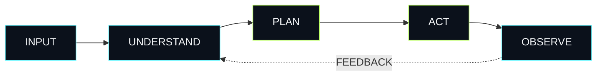

<div align="center">


### `OBSERVE` → `PLAN` → `ACT` → `IMPROVE`

**A developer lab for building practical AI agents and automated workflows.**

<p>
<a href="https://moiz-exe.github.io/My_Agents/"></a>
<a href="https://github.com/moiz-exe/My_Agents"></a>
<a href="./automated-social-media-management-agent/"></a>
</p>

</div>

---

## ⚡ Agentic Core



> **The idea:** turn repetitive digital work into systems that can reason, execute, and respond to results.

---

## 🤖 Current Agent

### Automated Social Media Management Agent

Exploring **AI-assisted social-media workflows, automation, and agent-based task execution.**

`Python` · `AI` · `Automation` · `Agentic Systems`

**→ [Explore Agent](./automated-social-media-management-agent/)**

---

## 🧬 Stack

<p>

</p>

`AI` · `Machine Learning` · `Automation` · `AI Agents`

---

## 🗺️ Direction

```text
BUILD
  ↓
EXPERIMENT
  ↓
AUTOMATE
  ↓
CONNECT
  ↓
SCALE
```

More agents and workflows will be added as the lab evolves.

---

<div align="center">

### Abdul Moiz

**Developer · AI/ML Learner · Builder**

`Learn → Build → Break → Improve`

<a href="https://github.com/moiz-exe">GitHub ↗</a>

<br><br>

<sub>My_Agents · Built with curiosity and code.</sub>

</div>
